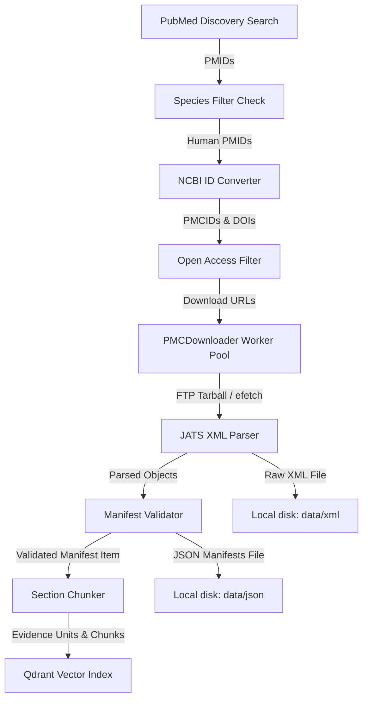
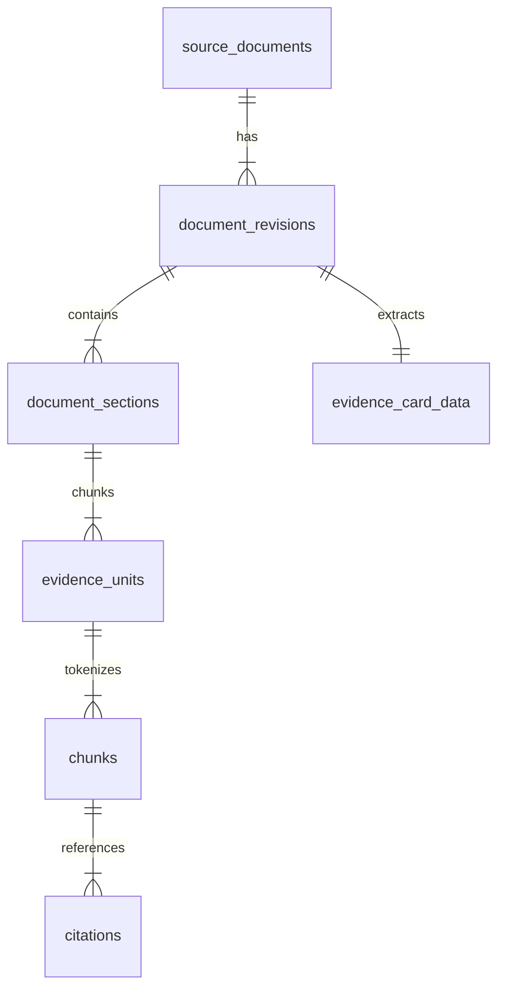

# Ingestion Pipeline AI Specification (INGESTION_PIPELINE_AI_SPEC)

This document is a technical specification of the PMC oncology ingestion pipeline. It is optimized as a long-term reference for AI coding agents building downstream systems (embeddings, indexing, retrieval, reranking, and generation).

---

## 1. Purpose and Architecture

The ingestion pipeline is a modular, high-throughput, rate-limited system designed to harvest clinical oncology papers from PubMed Central (PMC), parse them into structured text sections, validate them against a strict data contract, chunk them using token-aware boundaries, and index them into relational and vector databases.

### Core Architectural Patterns:
* **Producer-Consumer Worker Pool**: Orchestrates async worker coroutines using `asyncio.Queue` and a bounded `asyncio.Semaphore` to throttle concurrency and control memory footprint.
* **Storage Separation**: Saves raw source artifacts (`.xml`) and processed schemas (`.json` manifests) to the local file system. Canonical metadata, audit trails, and chunk indices are stored in relational databases. Vector indices are stored in Qdrant.
* **Validation Gates**: Blocks pipeline progression on failure to pass schema checks, retraction status updates, or species filter violations.

---

## 2. End-to-End Data Flow



---

## 3. Pipeline Stages and Guarantees

### 3.1 Search Stage (`PubMedSearcher`)
* **Inputs**: Search queries configured in `config.yaml` (e.g. `rct`, `meta_analysis`, `systematic_review`, `guideline`).
* **Outputs**: List of unique PMIDs.
* **Guarantees**:
  * Employs token-bucket rate limiting to respect NCBI E-utilities thresholds (10 requests/sec with API key, 3 requests/sec without).
  * Deduplicates PMIDs across queries.
  * Deterministic checkpoint saving via `CheckpointManager`.

### 3.2 Species Filter Stage (`SpeciesFilter`)
* **Inputs**: PMIDs from search stage.
* **Outputs**: List of human-only study PMIDs.
* **Guarantees**:
  * Queries NCBI `esummary` to inspect MeSH major descriptors.
  * Filters out papers with animal-only terms (e.g. `Animals`, `Mice`, `Rats`) unless human terms (`Humans`) are explicitly present.

### 3.3 Convert Stage (`IDConverter`)
* **Inputs**: Filtered PMIDs.
* **Outputs**: Mappings of `PMID -> PMCID` and `PMID -> DOI`.
* **Guarantees**:
  * Resolves external IDs using NCBI converter API.
  * Skips papers lacking a valid PMCID (PMC database registration).

### 3.4 Open Access Filter Stage (`OAFilter`)
* **Inputs**: PMCIDs.
* **Outputs**: OA download URLs or efetch fallbacks.
* **Guarantees**:
  * Validates display-rights/Open Access availability via PMC Open Access Web Service.

### 3.5 Download & Parser Stage (`PMCDownloader` & `JATSParser`)
* **Inputs**: Target PMCIDs and download URLs.
* **Outputs**: Raw JATS XML, parsed JSON manifest, sections, and structured tables.
* **Guarantees**:
  * Tries downloading FTP archive first; falls back to NCBI efetch XML.
  * Content-hash deduplication: computes SHA-256 of downloaded XML and checks against the database before parsing.
  * Exclusion Checks: parser identifies retracted papers or editorial notes by scanning JATS elements.

### 3.6 Schema Validation Gate (`validate_manifest_item`)
* **Inputs**: Manifest item dictionary.
* **Outputs**: Validated JSON written to disk.
* **Guarantees**:
  * Strict schema verification using `jsonschema` against the `v1.schema.json` contract.
  * Blocks indexing of invalid, partial, or malformed data.

### 3.7 Section Chunker Stage (`SectionChunker`)
* **Inputs**: Validated section text strings.
* **Outputs**: Nested list of parent `EvidenceUnit` blocks and child `Chunk` items.
* **Guarantees**:
  * Strict sentence boundary preservation.
  * Does not split table rows.
  * Calculates exact character start/end spans relative to parent section text.

### 3.8 Vector Indexing Stage (`QdrantIndexClient`)
* **Inputs**: Child chunks, token counts, and metadata payloads.
* **Outputs**: Dense (1024-dim) and Sparse named vectors upserted to Qdrant.
* **Guarantees**:
  * Attaches filtering payload (retraction status, display rights, study type, MeSH terms) to support downstream retrieval constraints.

---

## 4. Schema Specifications

### 4.1 SQLite Ingestion Database (`papers.db`)

#### Table: `papers`
* `pmcid` (TEXT, PK): Canonical PMC Identifier.
* `pmid` (TEXT): PubMed ID.
* `doi` (TEXT): Digital Object Identifier.
* `title` (TEXT): Title.
* `journal` (TEXT): Journal name.
* `publication_date` (TEXT): ISO format (YYYY-MM-DD).
* `publication_types` (TEXT): JSON-serialized list.
* `mesh_terms` (TEXT): JSON-serialized list.
* `clinical_trial_ids` (TEXT): JSON-serialized list of registries (NCT/ISRCTN).
* `status` (TEXT): `DISCOVERED` | `DOWNLOADING` | `DOWNLOADED` | `PROCESSING` | `PROCESSED` | `EMBEDDING_PENDING` | `EMBEDDED` | `FAILED_DOWNLOAD` | `FAILED_PROCESSING` | `FAILED_EMBEDDING` | `duplicate` | `excluded`.
* `error_message` (TEXT): Error traces for debugging.
* `retries` (INTEGER): Attempt counter.
* `downloaded_at` (TEXT), `processed_at` (TEXT), `embedded_at` (TEXT): Timestamps.
* `is_human_study` (INTEGER), `is_animal_study` (INTEGER): Boolean flags.
* `download_url` (TEXT): Source download path.
* `content_hash` (TEXT): SHA-256 of raw XML.

---

### 4.2 Ingestion Manifest JSON Schema (`v1.schema.json`)
The output contract written to `data/json/{pmcid}.json` contains:
```json
{
  "schema_version": "1.0.0",
  "run_id": "UUID",
  "timestamp": "ISO8601-DateTime",
  "items": [
    {
      "source": "pmc",
      "pmid": "string",
      "pmcid": "string",
      "doi": "string",
      "title": "string",
      "authors": ["string"],
      "journal": "string",
      "publication_date": "YYYY-MM-DD",
      "canonical_url": "string",
      "display_rights": true,
      "retraction_status": "not_retracted | retracted | corrected",
      "content_sha256": "string (hex)",
      "parser_name": "jats_parser",
      "parser_version": "1.0.0",
      "source_artifact_uri": "string (URI)",
      "study_type": "rct | meta_analysis | systematic_review | guideline | observational | other",
      "mesh_terms": ["string"],
      "clinical_trial_ids": ["string"],
      "sections": [
        {
          "section_path": ["string"],
          "section_kind": "introduction | methods | results | discussion | conclusion | recommendations | executive_summary | other",
          "ordinal": 0,
          "text": "string",
          "source_locator": {
            "kind": "xpath | pdf_rectangle | none",
            "locator": {}
          }
        }
      ],
      "tables": [
        {
          "linearized_text": "string",
          "structured_json": {
            "caption": "string",
            "headers": ["string"],
            "rows": [["string"]]
          }
        }
      ],
      "evidence_card_fields": {
        "population": { "value": "string", "confidence": "high|medium|low|Not extracted", "source_locator": {} }
      }
    }
  ]
}
```

---

### 4.3 PostgreSQL Target Database Schema (SQLAlchemy Models)

Downstream applications read from the following SQL tables populated by the migration scripts:



* **`source_documents`**: PK `id` (UUID), unique `(source, source_key)`. Keeps track of displays, retractions, and title/journal tags.
* **`document_revisions`**: PK `id` (UUID), FK `document_id`. Tracks content updates and hashes.
* **`document_sections`**: PK `id` (UUID), FK `revision_id`. Stores raw section text, kinds, and JATS/PDF locators.
* **`evidence_units`**: PK `id` (UUID), FK `section_id`. Parent context blocks (600–1200 tokens) of type `prose` or `table`.
* **`chunks`**: PK `id` (UUID), FK `evidence_unit_id`. Child retrieval blocks (256–320 tokens).
* **`evidence_card_data`**: PK/FK `revision_id`. Base extracted evidence variables (population, intervention, outcomes).

---

## 5. Ingestion-Vector Contract Specification

The embedding pipeline processes raw text chunk outputs and indexes them into Qdrant.

### 5.1 Chunk Text Format
Child chunks are extracted directly from the database `chunks` table or the manifest JSON `sections` and `tables` files. 

### 5.2 Embedding Configuration (BGE-M3)
* **Dense Vectors**:
  * Dimensions: `1024`
  * Distance Metric: `Cosine`
* **Sparse Vectors**:
  * Type: Lexical sparse vector format mapping term indices to weights.
* **Mock Vectors Protocol**:
  * In the mock configuration, dense vectors are generated as a list of 1024 floats (`float(i % 10) / 10.0`) and sparse vectors are hardcoded to indices `[10, 25, 42]` with values `[0.6, 0.35, 0.15]`.
  * **How to update to real embeddings**: Replace the mock generator loops inside [downloader.py](file:///C:/Users/ASHIRWAD%20PRATAPSINGH/.gemini/antigravity/scratch/pmc-pipeline/pipeline/downloader.py) (around lines 396–404 for sections and 429–437 for tables) with calls to a real BGE-M3 model instance (e.g. `SentenceTransformer("BAAI/bge-m3")` from `sentence-transformers` package) to compute actual dense vectors and sparse weights from chunk text.
* **Indexing Payload**:
  Every upserted point in Qdrant **MUST** include the following structure under its payload dictionary for retrieval routing:
  ```json
  {
    "chunk_id": "string (UUID or custom hierarchy)",
    "evidence_unit_id": "string (UUID)",
    "document_id": "string (PMCID)",
    "study_type": "string (rct | meta_analysis | systematic_review | guideline | other)",
    "mesh_terms": ["string"],
    "retraction_status": "string (not_retracted | retracted)",
    "display_rights": true
  }
  ```

---

## 6. Document Identifiers and Chunk Spans

### 6.1 Identifiers Strategy
* **Document Identity**: PMCID (e.g. `PMC10253654`) is the external primary identifier. Internally, a UUID v4 string is mapped to it in PostgreSQL `source_documents.id`.
* **Evidence Unit & Chunk IDs**: Custom strings generated using document key and section indices:
  * Section Key: `PMC10253654_introduction`
  * Evidence Unit (Parent) ID: `PMC10253654_introduction_P01`
  * Chunk (Child) ID: `PMC10253654_introduction_P01_C01`
* **Qdrant Point UUID**: Generated deterministically using UUID v5 from the chunk string ID:
  ```python
  point_uuid = uuid.uuid5(uuid.NAMESPACE_DNS, chunk_id)
  ```

### 6.2 Chunk Span Mapping
The `chunks` table stores `start_char` and `end_char` offsets relative to its parent section text. 
* **Span Preservation Invariant**: `section_text[chunk.start_char : chunk.end_char] == chunk.text`.

---

## 7. State Transitions and Paper Lifecycle

A paper moves through the following states in the `papers` ingestion log:

```text
[DISCOVERED]
     │
     ▼
[DOWNLOADING] ──► [FAILED_DOWNLOAD] (retry up to threshold)
     │
     ▼
[DOWNLOADED]
     │
     ▼
[PROCESSING] ──► [FAILED_PROCESSING] / [excluded] / [duplicate]
     │
     ▼
[PROCESSED]
     │
     ▼
[EMBEDDING_PENDING] ──► [FAILED_EMBEDDING]
     │
     ▼
[EMBEDDED]
```

---

## 8. Directory Structure and Module Responsibilities

```text
pmc-pipeline/
├── config.yaml                # Rate limits, search terms, and filesystem directories.
├── run_pipeline.py            # CLI entry point; orchestrates discovery, conversion, and downloader.
├── pipeline/
│   ├── config.py              # Configuration loading parser.
│   ├── database.py            # SQLite metadata database engine.
│   ├── downloader.py          # Concurrency worker pool, download methods, and chunk/validate wire-in.
│   ├── parser.py              # JATS XML element tree extractor.
│   ├── chunker.py             # Sentence segmentation and token-aware window slider.
│   ├── models.py              # SQLAlchemy database classes.
│   ├── manifest_validator.py  # JSON Schema validation helper.
│   └── vector_index.py        # Qdrant vector index client.
├── scripts/
│   ├── migrate_to_postgres.py # Data migration script to backfill PostgreSQL target schemas.
│   └── inspect_mirror.py      # Local database inspection utility.
└── tests/
    └── test_migration.py      # Verification tests (chunking boundaries, schemas, validation).
```

---

## 9. Configuration, Logging, and Error Handling

* **Configuration**: Defined in `config.yaml`, parsed into frozen dataclasses in `pipeline/config.py`.
* **Logging**: Output is formatted with timed log levels (`INFO`, `DEBUG`, `ERROR`) and printed to stdout/stderr or output log files.
* **Error Handling**: Exceptions raised during downloading, parsing, chunking, or indexing do not halt the process. They update the target database row status (e.g. `FAILED_PROCESSING`), dump the traceback stack to `error_message`, and increment the retry counter.

---

## 10. Stable Interfaces vs. Internal Details

### Downstream Dependencies Can Safely Assume:
1. **JSON Manifest Schema Versioning**: Manifests written to `data/json/` conform to the validated schema shape of `v1.schema.json`.
2. **PostgreSQL Relational Schema Stability**: Table models in [models.py](file:///C:/Users/ASHIRWAD%20PRATAPSINGH/.gemini/antigravity/scratch/pmc-pipeline/pipeline/models.py) reflect the target schema.
3. **Chunk Span Correctness**: Character start and end offsets mapped in database chunks correspond exactly to raw section texts.

### Downstream Dependencies MUST NOT Assume:
1. **SQLite Database Availability**: `papers.db` is purely a local pipeline ingestion log and is not intended for retrieval operations.
2. **Qdrant Client Setup**: The vector client employs fallback mock client strategies when external server addresses are unreachable.
3. **PICO / Clinical Field Extraction Accuracy**: Currently defaulted to `"Not extracted"` values (NOT IMPLEMENTED).

---

## 11. Extension Points

* **`JATSParser._extract_sections`**: Developers can add custom section tag titles (like `supplementary-material` or `discussion`) to the `_SECTION_MAP` dictionary.
* **`classify_evidence_category`**: Priority matching rules for clinical categories can be expanded to cover new study categories (e.g. `cohort_study`).
* **`EvidenceCardData`**: Ingestion of clinical outcomes (PICO variables) is defined but placeholder-only. Future agents can hook an extraction engine (like an LLM parser) directly into the manifest validation parser.

---

## 12. Current Limitations, Assumptions, and Technical Debt

* **Token Estimation Approximation**: The chunker counts tokens based on a word-splitting scale factor of `1.33` (assuming 1.33 tokens per word). Actual tokenizations from BGE-M3 subword models may vary slightly.
* **Mock Embeddings**: The pipeline downloader generates mock dense and sparse vectors (represented by math patterns) for indexing tests.
* **No PDF Parsing**: Ingestion processes PMC JATS XML files only; parsing of direct guidelines in `.pdf` format is NOT IMPLEMENTED.
