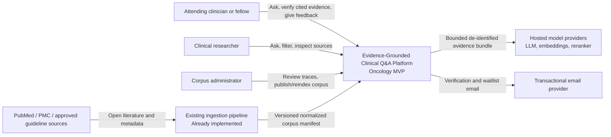
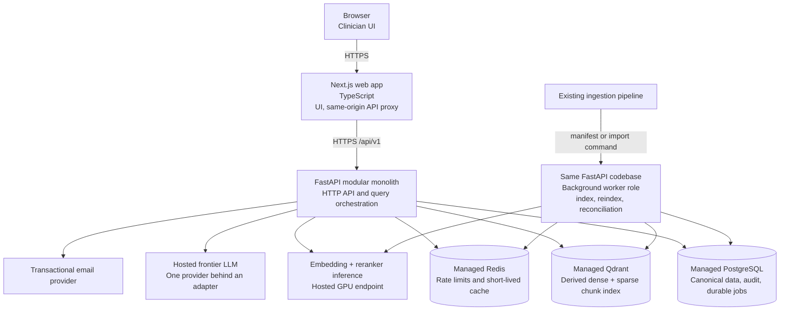
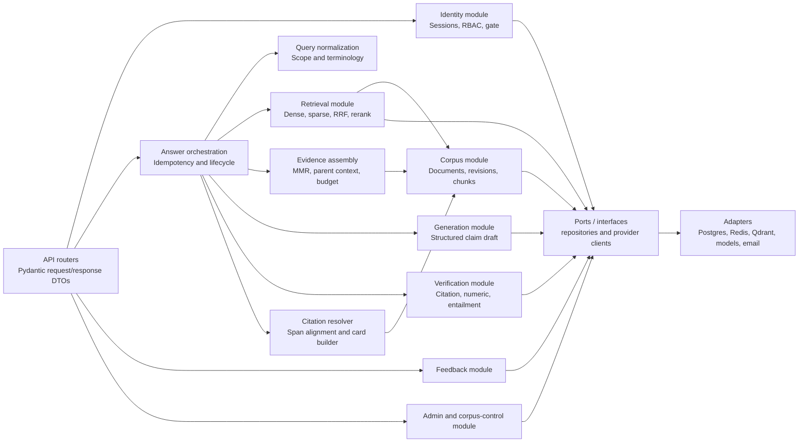
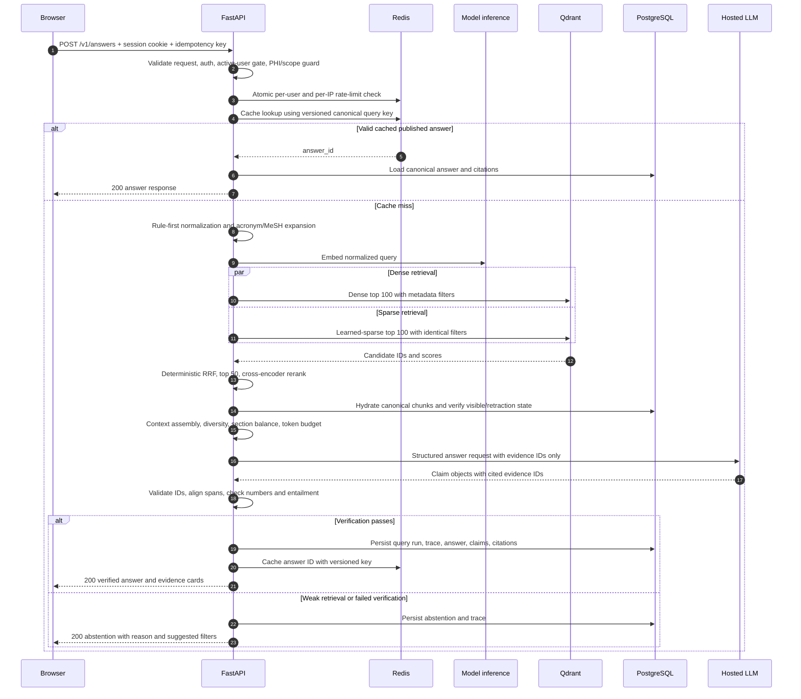
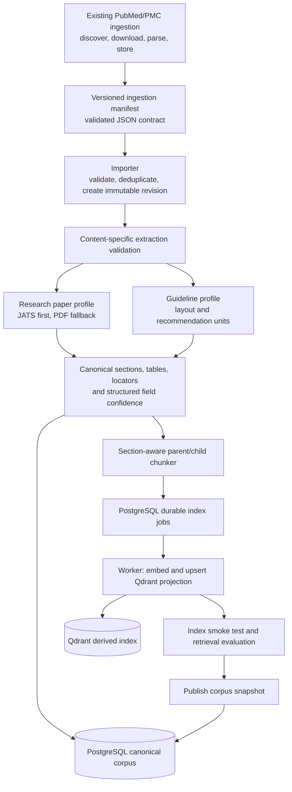
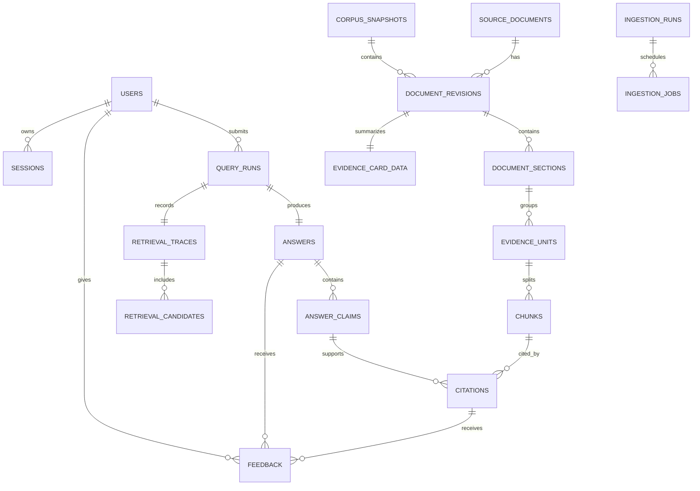
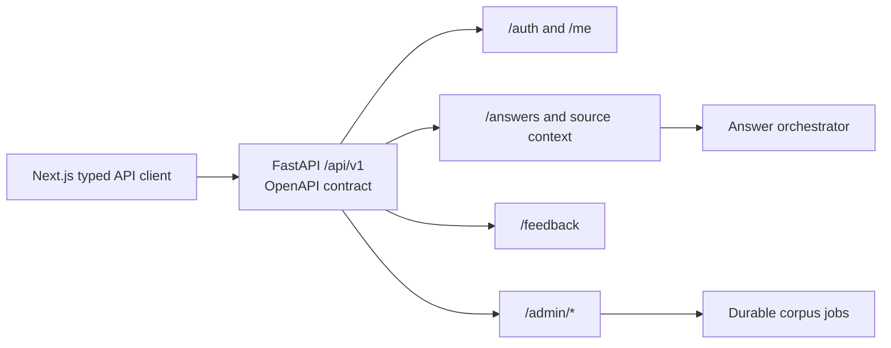
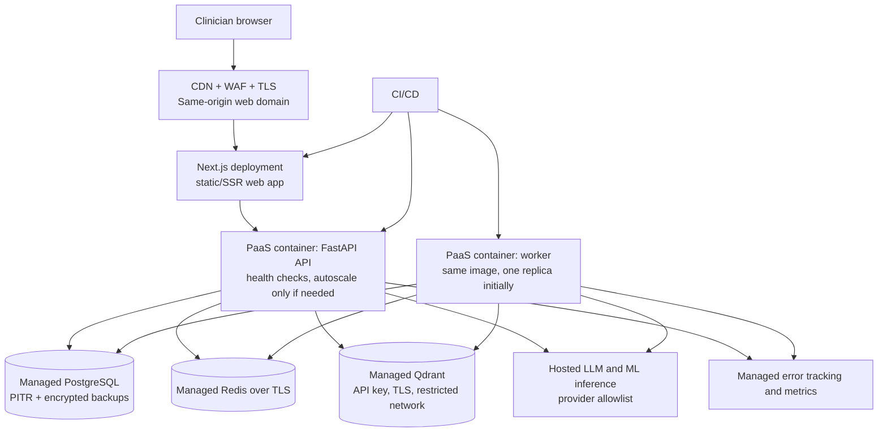

# Evidence-Grounded Clinical Q&A MVP - Engineering Blueprint

**Source:** `PRD.pdf` (15 pages, reviewed 2026-07-17)  
**Audience:** the three-person engineering team and AI coding agents  
**Product boundary:** oncology-focused PubMed/PMC evidence Q&A. This is clinical decision support, not diagnostic or treatment advice.

## 1. Executive architectural decision

Build one **modular monolith**: a Next.js web app, one FastAPI codebase deployed in two process roles (API and background worker), and managed PostgreSQL, Redis, Qdrant, and model providers. The existing ingestion pipeline remains the upstream corpus producer; this product adds a strict, versioned import-and-index contract around it.

The product is retrieval-first. The LLM never publishes a free-form answer directly: it returns structured claims pointing only to supplied evidence IDs; server-side verification, span alignment, and citation rendering decide what can be shown. An answer that cannot be verified is an abstention, not a degraded answer.

### MVP non-negotiables

- Every clinically material displayed claim has one or more verified citations.
- Every citation resolves to immutable canonical source text and a displayable source span.
- Retracted, unlicensed-for-display, unpublished, and out-of-scope evidence cannot enter the answer context.
- PostgreSQL is the canonical record. Qdrant is a rebuildable derived retrieval index.
- The online path is bounded and synchronous; do not token-stream an answer before verification.
- No patient data, EHR data, mobile app, multi-agent workflow, knowledge graph, microservice fleet, Kubernetes, Kafka, or separate search cluster in the MVP.

### Success gates taken from the PRD

| Area | MVP gate |
|---|---|
| Latency | p50 under 8 seconds and p95 under 15 seconds for a standard answerable question |
| Citation coverage | At least 95% of clinically material answer sentences have at least one valid citation |
| Citation integrity | 100% resolve to a stored chunk and a source span |
| Faithfulness | At least 0.90 on the versioned evaluation set, plus human clinical spot checks |
| Fabricated references | Zero in release evaluation |
| Safety | Abstain when retrieval, grounding, or corpus coverage is inadequate |

## 2. Architectural principles

1. **Evidence is a domain object.** Documents, revisions, chunks, claims, citations, source spans, and retrieval traces are persisted entities, not presentation details.
2. **Prefer deterministic steps before probabilistic steps.** Normalize, filter, retrieve, fuse, and validate deterministically; use an LLM only for synthesis over a bounded evidence bundle.
3. **Version everything that affects an answer.** Corpus snapshot, parser/chunker, embedding model, retrieval profile, reranker, prompt schema, LLM model, and verifier version are stored with every query run.
4. **One deployment boundary, clean code boundaries.** Modules communicate through Python interfaces and domain DTOs, not HTTP calls to one another.
5. **Quality before breadth.** Oncology only, clinician-gated access, and source-backed answers are more valuable than broad but unreliable medical coverage.
6. **Measure before tuning.** No default retrieval model, ranker, threshold, or prompt changes without a versioned evaluation comparison.

## 3. C4 System Context



**System boundary:** only the platform has credentials to its data stores and model providers. Browsers never call Qdrant, PostgreSQL, Redis, or model APIs directly.

## 4. C4 Container Diagram



The API and worker are **two runtime roles of one repository and one domain model**, not microservices. They may scale independently only because request latency and offline indexing have different resource profiles.

| Container | Responsibilities | Must not own |
|---|---|---|
| Next.js web app | Auth screens, question UI, answer/evidence pane, source panel, feedback, admin screens | Medical retrieval logic or credentials to infrastructure |
| FastAPI API role | Authentication, authorization, request validation, orchestration, answer publication, trace persistence | Long-running embedding/reindex work |
| Worker role | Import manifests, build chunks, invoke embeddings, update Qdrant, retraction reconciliation, durable job retries | User-facing request handling |
| PostgreSQL | Canonical corpus, revisions, claims/citations, users/sessions, feedback, audit, durable job state | Vector similarity as the primary online index |
| Redis | Rate-limit counters, idempotency/cache keys, short-lived query result cache, distributed locks where necessary | Authoritative job or evidence data |
| Qdrant | Rebuildable dense and sparse vectors plus filter payload | Canonical text, audit data, or source-of-truth permissions |

## 5. C4 Component Diagram - FastAPI modular monolith



### Module rules

| Module | Public responsibility | Boundary rule |
|---|---|---|
| `identity` | User lifecycle, email verification, sessions, roles, allowlist | The only module that creates/revokes sessions; no retrieval imports |
| `corpus` | Canonical document/revision/section/chunk records and source display policy | Qdrant payload is a projection, never the authority |
| `retrieval` | Normalized query to ranked child chunk IDs and a trace | Returns evidence references and scores, never text generated by an LLM |
| `answering` | Coordinates one query run and its state transitions | Has no direct SQL/Qdrant calls; uses ports and module services |
| `verification` | Decides whether a claim/citation pair is publishable | It is the only module allowed to mark an answer `published` |
| `evidence` | Context package, source span resolution, evidence cards | Evidence card fields come from extracted data or pinned text, never LLM invention |
| `ingestion` | Manifest validation, revision import, chunk/index job creation | Does not serve HTTP requests except admin job controls |
| `feedback` | Answer/citation feedback tied to a specific run | Can only reference an answer visible to the submitting user |
| `admin` | Read-only diagnostics, reindex/publish controls, review queues | All mutating actions require `admin` and an audit event |

Dependency direction is `API -> domain modules -> ports -> adapters`. Domain modules must not import FastAPI, SQLAlchemy models, Qdrant clients, or a provider SDK directly.

## 6. End-to-End Query Flow



### Online-path budgets and guardrails

| Stage | Target budget | Implementation guardrail |
|---|---:|---|
| Auth, rate limit, cache | 100 ms | Fail closed on Redis rate-limit uncertainty; cache is optional |
| Normalize and scope check | 100 ms | Rules and curated terminology only by default |
| Query embedding + dense/sparse retrieval | 1.0 s | Concurrent requests; explicit provider and Qdrant timeouts |
| RRF + rerank | 1.5 s | Rerank at most 50 truncated candidates in one batch |
| Hydration and context assembly | 500 ms | Fetch canonical text in one batched PostgreSQL query |
| Structured generation | 7 s | Bounded input, timeout, one retry only for a repairable schema error |
| Verification + persist | 2.5 s | No second free-form regeneration; abstain on material failure |

These are budgets, not guarantees. The API should record per-stage timing so the p95 breach is attributable to a provider, retrieval, or application component.

## 7. RAG and Evidence Architecture

```mermaid
flowchart LR
    rawq["Clinical question + filters"] --> norm["Deterministic normalization\nacronyms, MeSH, spelling"]
    norm --> scope["Oncology / PHI / coverage guard"]
    scope --> embed["BGE-M3 query embedding"]
    embed --> dense["Dense top 100"]
    norm --> sparse["Sparse top 100"]
    dense --> rrf["Application-level RRF\nfully traced"]
    sparse --> rrf
    rrf --> rerank["Cross-encoder top 50"]
    rerank --> policy["Evidence selection policy\nMMR, per-doc cap, section balance"]
    policy --> bundle["Bounded evidence bundle\n8-12 child chunks plus parent context"]
    bundle --> draft["LLM structured claim draft\nclosed-book contract"]
    draft --> validator["Server verification\nIDs, spans, numbers, entailment"]
    validator --> answer["Verified answer with evidence cards"]
    validator --> abstain["Abstain / retry only if safe"]

    corpus["Canonical corpus records"] --> dense
    corpus --> sparse
    corpus --> bundle
```



### 7.1 Retrieval profile v1

| Step | v1 behavior | Quality reason |
|---|---|---|
| Query normalization | Unicode/whitespace normalization; curated oncology acronym, generic/brand, and MeSH synonym expansion; retain raw and normalized form | Medical exact terms and trial acronyms matter; rules are auditable and low-latency |
| Metadata filter | Apply user filters plus `is_retrievable=true`, `retraction_status=not_retracted`, corpus snapshot, display-rights, and oncology scope before vector search | Do not retrieve invalid evidence and then try to remove it later |
| Initial retrieval | BGE-M3 dense top 100 and BGE-M3 learned-sparse top 100 in Qdrant | Dense captures clinical paraphrase; sparse preserves drug, biomarker, dosage, and trial-token precision |
| Fusion | Application-level Reciprocal Rank Fusion, `k=60` initially; persist rank from each leg and the fused score | Robust to incomparable score scales and fully explainable in the trace |
| Rerank | Cross-encoder on fused top 50; retain top 8-12 candidates before context policy | High-stakes answers need precision at the top of the list |
| Context policy | MMR de-duplication, max three child chunks per document, Methods + Results balance, guideline recommendation intact, bounded parent window | Prevents six near-duplicates and makes population/comparator/outcome inspectable |
| Evidence-type policy | Expose and use study type as a small, configurable tie-breaker, not a universal truth ranking | A guideline, RCT, meta-analysis, and observational study have different roles; relevance remains primary |
| Answering | Low-temperature structured response with stable evidence IDs and no outside knowledge | Makes invalid references detectable before rendering |
| Verification | Structural citation, span, numeric, and entailment checks; material failure becomes abstention | Groundedness cannot rest on prompt wording alone |

### 7.2 Context package and generation contract

The generator receives only a bounded `EvidenceBundle`. Each source is labeled with a stable ID such as `E07`, document metadata, study type, and sentence IDs. It cannot cite a document that was not in the bundle.

```json
{
  "status": "answer | insufficient_evidence",
  "direct_answer_claims": [
    {
      "text": "One clinically material sentence.",
      "evidence_ids": ["E07"],
      "sentence_ids": ["E07.S2"]
    }
  ],
  "evidence_summary_claims": [],
  "limitations_claims": [],
  "abstention_reason": null
}
```

The server, not the LLM, assigns visible citation marker numbers and renders the final answer. For each claim it:

1. rejects unknown evidence or sentence IDs;
2. confirms the cited chunk belongs to the assembled context and current corpus snapshot;
3. resolves the selected sentence to a stored character span;
4. checks every numeric value, percentage, confidence interval, dosage, and sample size against cited text after safe normalization;
5. applies an entailment/semantic-support check as a **screening signal**, not as proof of clinical truth;
6. drops only isolated non-material display text when safe; otherwise returns a controlled abstention; and
7. stores claim-level verification results and the source revision used.

Do not ask the model for PDF coordinates or character offsets. It is reliable enough to choose from supplied IDs only after server validation; source offsets must come from the canonical corpus.

### 7.3 Confidence and abstention

`high`, `moderate`, and `low` are system-calibrated labels, not LLM self-reported confidence. The score uses retrieval strength, evidence diversity, study/source metadata, citation-verification pass rate, corpus coverage, and conflict signals. It is not a clinical recommendation score.

Return `status=abstained` when any of these occurs:

- question is out of oncology scope or contains likely patient-identifying information;
- no candidate clears a calibrated retrieval threshold;
- only retracted, unlicensed, or otherwise non-displayable sources remain;
- a material claim lacks a verified citation after one structured repair attempt;
- output claims conflict materially and the evidence bundle cannot support a transparent reconciliation.

## 8. Ingestion Pipeline Architecture

The existing pipeline is retained. Do not rewrite it as part of the MVP. Instead, put an explicit quality gate between its output and the retrieval corpus.



### 8.1 Required ingestion contract

Create `integrations/ingestion_contract/v1.schema.json`. Each manifest item must include:

- source and stable external IDs (`pmid`, `pmcid`, DOI, guideline publisher identifier where available);
- canonical source URL, license/display-rights flag, retraction/correction status, publication date, authors, journal, and MeSH terms;
- immutable content checksum, parser name/version, source artifact location, and external ingestion run ID;
- ordered sections with canonical normalized text and source locators (JATS/XPath or PDF page/rectangle); and
- tables as both structured JSON and linearized retrieval text, plus structured clinical fields with per-field confidence and source locator.

An item missing canonical text or stable locators is `citation_not_ready` and cannot be published to the answer corpus. It may remain in an admin repair queue, but it is not a candidate source.

### 8.2 Extraction and chunking rules

| Content | Rule |
|---|---|
| Research papers | Prefer PMC JATS XML. Preserve IMRaD section path, abstracts, methods, results, tables, and references. Use scholarly PDF parsing only as fallback. |
| Guidelines | Treat each recommendation as an atomic parent unit. Preserve its evidence/strength label, eligible population, and surrounding condition/algorithm context. |
| Parent unit | A bounded section-aware context window, normally 600-1,200 tokens; do not use an unbounded full Results section. |
| Child chunk | Normally 256-320 tokens with approximately 15% overlap. Never split a table row, statistical result sentence, or guideline recommendation. |
| Tables | Store a linearized representation for retrieval and structured JSON for evidence cards. Show a number only when its source and confidence are known. |
| Figures and supplements | Index captions and surrounding results text. Do not perform image-based clinical interpretation in MVP; default-rank supplements lower. |
| Structured clinical fields | Store `{value, confidence, source_locator}`. If confidence is low, render `Not extracted`; never infer a value at answer time. |

### 8.3 Durable job and publication design

- `ingestion_jobs` in PostgreSQL is the durable work ledger: status, lease, attempt count, next attempt, error, and target corpus/index version.
- A single worker claims jobs using `FOR UPDATE SKIP LOCKED`, with idempotent handlers. Redis may trigger work or hold locks, but it is never the durable record of whether a document was indexed.
- The vector projection is allowed to be temporarily ahead of or behind PostgreSQL. The query path rehydrates every winning candidate from PostgreSQL and drops anything not `published` and retrievable.
- Incremental document updates create a new immutable `document_revision`; they never mutate cited text in place.
- Parser/chunker/embedding migrations build a new versioned Qdrant collection, pass the evaluation gate, then change a single active-index record. Rollback is a configuration change, not destructive reindexing.
- Retraction status is checked both in Qdrant payload filtering and again in PostgreSQL at hydration. A scheduled reconciliation job updates late retractions and invalidates relevant cache keys by corpus version.

## 9. Database Schema Design



### 9.1 Canonical PostgreSQL tables

| Table | Required columns | Key constraints and purpose |
|---|---|---|
| `users` | `id`, `email`, `password_hash`, `role`, `status`, `email_verified_at`, timestamps | `email` unique (`citext`); roles are `clinician`, `researcher`, `admin`; status is `pending`, `active`, `suspended` |
| `sessions` | `id`, `user_id`, `token_hash`, `expires_at`, `revoked_at`, `ip_hash`, `user_agent_hash` | Store only a hash of a random opaque session token; revocable and rotated |
| `source_documents` | `id`, `source`, `source_key`, `pmid`, `pmcid`, `doi`, `canonical_url`, `title`, `publication_date`, `retraction_status`, `display_rights` | Unique `(source, source_key)`; stable identity across content revisions |
| `document_revisions` | `id`, `document_id`, `corpus_snapshot_id`, `revision_no`, `content_sha256`, `parser_version`, `source_artifact_uri`, `study_type`, `metadata`, `status` | Immutable revision; only `published` is retrievable; cited answers retain this ID forever |
| `document_sections` | `id`, `revision_id`, `section_path`, `section_kind`, `ordinal`, `text`, `source_locator` | Locator is JATS/XPath or PDF page/rectangle; text is the source viewer authority |
| `evidence_units` | `id`, `section_id`, `ordinal`, `start_char`, `end_char`, `text`, `content_type`, `token_count` | Bounded parent context for a selected child chunk |
| `chunks` | `id`, `evidence_unit_id`, `ordinal`, `start_char`, `end_char`, `text`, `token_count`, `embedding_model`, `embedding_version`, `qdrant_point_id`, `index_status` | Immutable child retrieval unit; offsets are relative to the containing section |
| `evidence_card_data` | `revision_id`, `fields_json`, `extraction_version` | Every field includes value, confidence, and source locator; low-confidence fields are not displayed as facts |
| `corpus_snapshots` | `id`, `name`, `status`, `active_index_name`, `retrieval_profile_version`, `published_at` | One active published snapshot per environment; cache keys include its ID |
| `query_runs` | `id`, `user_id`, `raw_text`, `normalized_text`, `filters`, `corpus_snapshot_id`, `status`, `latency_ms`, timestamps | One immutable execution record per submitted answer request |
| `retrieval_traces` | `id`, `query_run_id`, `normalization`, `config`, `model_versions`, `timings` | Full reproducibility metadata, not only a final score |
| `retrieval_candidates` | `trace_id`, `chunk_id`, `stage`, `rank`, `score`, `score_details` | Preserve dense, sparse, fused, reranked, and selected candidates separately |
| `answers` | `id`, `query_run_id`, `status`, `rendered_markdown`, `confidence`, `generation_model`, `prompt_version`, `verification_summary` | One published answer or abstention per run; no answer is published before verification |
| `answer_claims` | `id`, `answer_id`, `ordinal`, `text`, `claim_type`, `verification_status` | Defines what counts as a material answer sentence |
| `citations` | `id`, `claim_id`, `chunk_id`, `marker_index`, `span_start`, `span_end`, `verification_status`, `supporting_text_hash` | Citation span is relative to immutable chunk text; unique `(claim_id, chunk_id)` |
| `feedback` | `id`, `user_id`, `answer_id`, `citation_id`, `vote`, `reason_code`, `free_text`, timestamp | A citation is optional but must belong to the supplied answer |
| `ingestion_runs` / `ingestion_jobs` | run metadata; document revision; target index; status; lease; attempts; error | Durable, inspectable offline work and admin diagnostics |
| `audit_events` | actor, action, target, request ID, redacted metadata, timestamp | Required for admin actions, access changes, corpus publish/reindex, and session events |

### 9.2 Important indexes and constraints

- B-tree: all foreign keys; `query_runs(user_id, created_at DESC)`; `source_documents(pmid)`; `source_documents(doi)`; `document_revisions(status, study_type)`; `ingestion_jobs(status, next_attempt_at)`.
- GIN: `source_documents.mesh_terms`, selected metadata filters, and optional `chunks.search_tsv` used only for diagnostics/fallback evaluation.
- `pg_trgm`: document title/DOI lookup for admin repair and deduplication.
- Partial: published/current corpus records, failed verification answers, and non-terminal ingestion jobs.
- Database constraint where possible: unique document revision number, unique citation marker per answer, unique candidate rank per `(trace, stage)`.
- Application transaction rule: an answer can become `published` only if every `answer_claim` marked material has at least one `verified` citation. Test this as a service-level invariant; a simple SQL constraint cannot enforce it across multiple rows.

### 9.3 Qdrant projection schema

```text
collection: evidence_chunks_<embedding_version>
point id: chunks.id (UUID)
vectors:
  dense: BGE-M3 dense vector
  sparse: BGE-M3 learned sparse vector
payload:
  chunk_id, evidence_unit_id, document_id, document_revision_id,
  corpus_snapshot_id, study_type, publication_year, mesh_terms,
  biomarker_terms, oncology_subdomain, section_kind, content_type,
  retraction_status, display_rights, is_retrievable,
  embedding_version, schema_version
```

Create payload indexes only for filter fields actually used in v1: corpus snapshot, retrievable/retraction state, study type, publication year, biomarker terms, and section/content type. Keep all full text and proof-bearing offsets in PostgreSQL. Qdrant supports dense and sparse vectors in a collection and hybrid retrieval with fusion; this is why it is appropriate as a derived index here. [Qdrant hybrid search documentation](https://qdrant.tech/documentation/search/text-search/hybrid-search/)

## 10. API Architecture



Generate TypeScript types from FastAPI's OpenAPI document in CI. Do not maintain hand-copied Python and TypeScript DTOs.

| Endpoint | Access | Contract |
|---|---|---|
| `POST /api/v1/auth/signup` | Public | Email/password signup creates a `pending` user and verification flow |
| `POST /api/v1/auth/login` | Public | Creates a secure opaque browser session only for verified, active users |
| `POST /api/v1/auth/logout` | Authenticated | Revokes current session |
| `POST /api/v1/auth/verify-email` | Verification token | Verifies email; admin/allowlist still controls active access |
| `GET /api/v1/me` | Authenticated | Current user, role, and gate status |
| `POST /api/v1/answers` | Active clinician/researcher | Synchronous verified answer or abstention; accepts `Idempotency-Key` |
| `GET /api/v1/answers/{answer_id}` | Owner or admin | Canonical stored result, useful for reload/history |
| `GET /api/v1/answers/{answer_id}/citations/{citation_id}/context` | Owner or admin | Source metadata, parent context, highlighted span, and external PubMed/PMC link |
| `POST /api/v1/feedback` | Active user, answer visible to user | Answer or citation feedback bound to exact answer/citation IDs |
| `GET /api/v1/admin/stats` | Admin | Corpus, latency, feedback, and job status summary |
| `GET /api/v1/admin/query-runs/{id}/trace` | Admin | Full sanitized trace, candidates, config, and verification results |
| `POST /api/v1/admin/corpus/reindex` | Admin | Enqueues a durable job and returns `202` plus job ID |
| `POST /api/v1/admin/corpus/publish/{snapshot_id}` | Admin | Publishes a pre-validated snapshot and writes an audit event |

### `POST /answers` contract

```json
{
  "question": "In HER2-low metastatic breast cancer, does T-DXd improve PFS versus chemotherapy?",
  "filters": {
    "study_types": ["rct", "meta_analysis"],
    "year_from": 2020
  },
  "mode": "standard"
}
```

```json
{
  "answer_id": "uuid",
  "query_run_id": "uuid",
  "status": "answered",
  "answer_blocks": [
    {"kind": "direct_answer", "text": "...", "citation_markers": [1, 2]},
    {"kind": "limitations", "text": "...", "citation_markers": [2]}
  ],
  "confidence": "moderate",
  "citations": [
    {
      "marker": 1,
      "citation_id": "uuid",
      "document_revision_id": "uuid",
      "study_type": "rct",
      "span": {"start": 121, "end": 246}
    }
  ],
  "evidence_cards": [],
  "latency_ms": 0
}
```

`200` is also correct for a safe abstention. Use `422` for invalid input or likely PHI, `403` for a pending/suspended user, `429` for rate limiting, and `503` only for a failure that prevents a safe abstention response. Never return unverified partial model text.

`mode` has only `standard` in the MVP. Preserve the field so a future research `recall` profile can be introduced behind evaluation and feature flags without breaking clients.

## 11. Authentication and Authorization Design

```mermaid
sequenceDiagram
    participant B as Browser
    participant W as Next.js same-origin proxy
    participant A as FastAPI identity module
    participant P as PostgreSQL
    participant E as Email provider

    B->>W: Sign up with email and password
    W->>A: POST /auth/signup
    A->>A: Validate password and hash with Argon2id
    A->>P: Create pending user and hashed verification token
    A->>E: Send verification link
    B->>W: Verify email then log in
    W->>A: POST /auth/login
    A->>P: Verify active user and password; create session record
    A-->>W: Set __Host-session HttpOnly Secure SameSite=Lax cookie
    W-->>B: Authenticated browser session
    B->>W: Unsafe request with CSRF token and Origin
    W->>A: Same-origin request plus cookie
    A->>A: Validate session, CSRF, role, status, ownership
```

### Chosen model

- Use email/password in v1 because the PRD requires it. Hash passwords with Argon2id through a maintained library; never invent password hashing or token crypto.
- Use a 256-bit opaque session token in a host-only `__Host-session` HTTP-only, Secure, `SameSite=Lax` cookie. Store only a token hash and expiry in `sessions`.
- Proxy `/api` through the web origin so the browser does not need a cross-origin bearer token or permissive CORS setup.
- Require CSRF protection and Origin checks for state-changing routes; rate limit login, signup, password-reset, and answer generation separately.
- Roles: `clinician`, `researcher`, `admin`. Status: `pending`, `active`, `suspended`. A verified user remains `pending` until clinician/allowlist approval.
- Enforce role and ownership via central FastAPI dependencies/policy functions. A clinician can read only their own answers/queries; admin access is audited.

**Not in MVP:** social login, SSO/SAML, organization/team tenancy, API tokens, and fine-grained permission graphs. They add support and security surface without validating the primary clinical-value hypothesis.

## 12. Deployment Architecture



### Deployment plan

- **Local development:** Docker Compose starts PostgreSQL, Redis, and Qdrant; API, worker, and web run with hot reload. Include a small licensed fixture corpus and fake model adapters so most tests need neither a GPU nor paid LLM calls.
- **Staging:** a separate Postgres database, Redis namespace, Qdrant cluster/collection, model credentials, corpus snapshot, and allowlist. Never point staging at production evidence or user data.
- **Private beta production:** one PaaS provider for the API and worker image; managed PostgreSQL, managed Redis, Qdrant Cloud/managed Qdrant, and a hosted inference provider. Start with one worker and one or two API instances only after load tests justify it.
- **Infrastructure as code:** Dockerfiles, Compose, environment manifests, migration command, and a small Terraform/Pulumi layer for managed resources once the deployment is stable. Do not begin with Kubernetes.
- **Release order:** migrate database -> deploy worker-compatible code -> complete/index corpus -> run evaluation gate -> publish snapshot -> deploy web feature -> monitor.

## 13. Security Architecture

```mermaid
flowchart LR
    browser["Browser"] --> waf["TLS, CDN/WAF, CSP"]
    waf --> web["Next.js\nno infrastructure secrets"]
    web --> api["FastAPI\nauth, RBAC, input validation, CSRF"]
    api --> db["PostgreSQL\nprivate credentials, encryption, backups"]
    api --> cache["Redis\nTLS, private access"]
    api --> vector["Qdrant\nTLS, API key, payload filters"]
    api --> model["Approved model provider\nno PHI policy"]
    worker["Worker\nallowlisted source acquisition"] --> db
    worker --> vector
    worker --> model
    audit["Redacted audit and telemetry"] <-- api
    audit <-- worker
```

### Controls by threat area

| Area | MVP control |
|---|---|
| Clinical safety | Closed-book evidence bundle, verified citations, retraction hard-stop, out-of-scope abstention, conflict/limitation display, persistent decision-support disclaimer |
| PHI and privacy | Product policy forbids PHI. Warn users before entry; detect common identifiers/clinical-note patterns server-side; reject suspected PHI before provider calls and avoid raw query text in application logs. This is not a substitute for HIPAA controls. |
| Authentication | Argon2id, opaque revocable session, email verification, allowlist gate, session rotation, CSRF/Origin validation, login throttling |
| Authorization | Central RBAC and resource ownership checks; admin-only corpus/trace controls; all admin actions audited |
| Input and web security | Pydantic bounds, 2,000-character question cap, parameterized SQL, output encoding, strict CSP, secure headers, CORS avoided through same-origin proxy |
| Corpus supply chain | Allowlist PubMed/PMC/approved guideline sources, verify checksums and parser version, record license/retraction state, never fetch user-supplied URLs |
| Prompt injection | Treat corpus text as quoted data, never instructions; delimit evidence; do not give model tools, browsing, database access, or system-prompt authority |
| Secrets and network | Runtime secret manager/environment injection, rotation plan, no secrets in client/build artifacts, TLS to every managed service, least-privilege service credentials |
| Observability | Redacted structured logs, request IDs, provider error reporting with PII scrubbing, no full prompt/evidence dump by default |
| Availability and cost | Per-user/IP quotas, idempotency keys, explicit provider timeouts, one bounded retry, circuit breaker to a safe abstention, backup/PITR restore test |

This MVP is **not automatically HIPAA, SOC 2, or production-EHR compliant**. It needs a data-processing/BAA decision, retention policy, legal review of guideline display rights, penetration test, incident process, and formal compliance work before accepting PHI or integrating EHR data.

## 14. Technology Stack Recommendations

| Layer | Recommendation | Why chosen | Alternatives considered and rejected for MVP |
|---|---|---|---|
| Web | Next.js + TypeScript + accessible component primitives | Fast two-pane UI, deployment maturity, strong Cursor ergonomics, SSR/static marketing pages | SPA-only React adds routing/build choices without a meaningful product gain; native/mobile is out of scope |
| API | FastAPI + Pydantic v2, Python 3.12+ | Async fan-out fits retrieval/model calls; native Python ecosystem for NLP and clear OpenAPI contracts | Node/Nest duplicates the Python ML boundary; Django is productive but its full-stack conventions do not help this API-first RAG core |
| Persistence | Managed PostgreSQL + SQLAlchemy 2 + Alembic | Strong transactions, provenance/audit relationships, durable job ledger, mature migrations | MongoDB weakens relational audit guarantees; ORM-free SQL slows schema evolution; a separate event store is unnecessary |
| Vector index | Managed Qdrant, derived from PostgreSQL | Native dense+sparse search and metadata filters fit hybrid medical retrieval; it is rebuildable rather than an authority | pgvector-only reduces one dependency but makes the desired sparse+dense/filter profile weaker; Elasticsearch/OpenSearch adds a cluster and search-ops burden |
| Cache/limits | Redis | Fast atomic quotas, idempotency, and short-lived versioned answer cache | Database-only rate limiting creates avoidable write contention; Redis is not used as permanent evidence/job truth |
| Offline work | PostgreSQL durable job table plus one worker process | Auditability and retry state stay with the corpus; smallest operational surface | Redis-only task queues can lose authoritative job history; Celery/SQS/Kafka add infrastructure not justified by one worker |
| Embeddings | BGE-M3 dense + learned sparse | A single model supplies dense and sparse representations and supports long input; it directly supports the hybrid + rerank approach | PubMedBERT is not an off-the-shelf retrieval model; separate dense plus BM25 models add tuning/operational paths. MedCPT remains an eval challenger, not a second default. [BGE-M3 model card](https://huggingface.co/BAAI/bge-m3) |
| Reranker | `bge-reranker-v2-m3` class cross-encoder behind an inference port | Top-k precision is more important than a few hundred milliseconds in a trust product | Bi-encoder only is not precise enough; LLM reranking is slower/costlier; ColBERT adds index complexity before evidence quality proves it necessary |
| LLM | One hosted frontier provider, wrapped by a small internal `LLMClient` port | Best MVP synthesis without GPU serving; provider can be chosen by the evaluation set | Self-hosted/open-weight deployment adds GPU, capacity, and safety ops; a multi-provider gateway/proxy is premature. Do not rely on automatic fallback across models. |
| Model inference | Hosted GPU inference endpoint behind `EmbeddingClient` and `RerankerClient` | Meets PRD latency without placing model servers inside the API container | CPU-only in API risks p95; running a model-serving microservice ourselves diverts the team from evidence quality |
| Observability | Structured logs, OpenTelemetry-compatible spans, managed error tracking | Find latency, citation, and provider failures without operating a metrics stack | Self-hosted ELK/Prometheus/Grafana is too much for private beta |
| Test/eval | Pytest, Playwright, contract tests, versioned offline evaluation harness | Makes faithfulness and retrieval regression testable before release | Manual demos and prompt spot-checks cannot protect clinical trust |

FastAPI's official security guidance supports standard password hashing and token/session patterns; use maintained libraries rather than custom implementations. [FastAPI security documentation](https://fastapi.tiangolo.com/tutorial/security/oauth2-jwt/)

## 15. Decision Log

Every material architectural choice is captured here so implementation does not drift through ad hoc AI-agent decisions.

| Decision | Chosen | Why | Alternatives considered | Why not now |
|---|---|---|---|---|
| System shape | Modular monolith | Three engineers can debug, test, and deploy one domain model rapidly | Microservices | Network contracts, distributed traces, and deploy coordination do not improve MVP evidence quality |
| Runtime roles | One API role + one worker role from same image | Isolates request latency from indexing without creating separate services | A single API process doing background work; many dedicated services | In-process jobs risk request starvation/restarts; more services are premature |
| Online response | Synchronous verified answer, no token streaming | User gets only a checked answer; 15-second p95 makes this feasible | Async polling, streaming partial text | Extra UI state and risk of displaying unverified content before citation checks |
| Corpus truth | PostgreSQL holds canonical text and audit records | Transactions and immutable relations are essential for reproducible citations | Qdrant-as-document-store | Vectors/payloads are not a sufficient evidence/audit authority |
| Vector store | Qdrant projection | Hybrid dense+sparse and filters match the PRD with limited custom search logic | pgvector-only, Elasticsearch | pgvector is a valid future simplification experiment; Elasticsearch is an operational overreach |
| Fusion | Application-level RRF | Deterministic, transparent per-leg trace, portable retrieval profile | Weighted raw scores, opaque native-only fusion | Scores are not calibrated across retrievers; native fusion is acceptable later if trace quality stays intact |
| Reranking | Cross-encoder top 50 | Precision at top context is a trust prerequisite | No reranker, LLM reranker, ColBERT | No reranker hurts relevance; LLM costs/latency; ColBERT adds index complexity |
| Query rewrite | Curated rules default; LLM rewrite flag only | Auditable, repeatable, and low latency | LLM rewrite on every request | Can change clinical intent and makes regressions hard to diagnose |
| Chunk shape | Section-aware parent/child units | Local finding precision plus population/method context | Fixed windows, pure semantic chunks, full hierarchy | Fixed windows break results; semantic boundaries vary; hierarchy overbuilds v1 |
| Parser profiles | Separate research-paper and guideline validation | IMRaD findings and recommendation units have different atomicity | Single generic parser | Loses guideline strength labels or paper section evidence |
| Corpus versioning | Immutable document revisions and versioned indexes | Makes old citations reproducible and rollback safe | In-place updates | A source panel could silently show changed text for an old answer |
| Evidence card data | Extracted fields plus confidence/source locators | Prevents plausible but invented clinical fields | LLM-generated cards | UI facts must be independently traceable |
| Citation format | Structured claim IDs then server rendering | Makes unknown IDs, unsupported spans, and numeric claims rejectable | LLM-generated Markdown/offsets | Models can fabricate markers and offsets |
| Faithfulness gate | Multi-check verifier with abstention | Defense in depth protects trust | Prompt-only grounding or a single NLI score | Prompt compliance and NLI alone are not reliable enough |
| Evidence hierarchy | Configurable secondary tie-breaker and transparent labels | Study type matters but does not replace relevance or clinical appraisal | Hard global RCT-first ordering | Guidelines and syntheses can be more useful depending on the question |
| Job durability | PostgreSQL ledger, Redis as speed layer | Corpus/index state is inspectable/recoverable | Redis-only queue, Celery, Kafka | Redis-only loses authority; Celery/Kafka add operations beyond workload |
| Auth | Opaque server-side browser sessions | Revocation, role changes, and clinician gating are simple | Long-lived JWT in browser; external IdP | JWT revocation/storage is less safe; IdP integration is added scope |
| API contract | OpenAPI-first generated TS types | Stops frontend/backend schema drift | Duplicated hand-written interfaces, GraphQL | GraphQL does not improve bounded task APIs and adds authorization complexity |
| ML deployment | Hosted model endpoints behind ports | Low time-to-quality and clear swap point | Self-host GPU / multi-model router | Serving is not the core product proof and router behavior harms reproducibility |
| Deployment | PaaS + managed stateful services + Compose locally | Small ops footprint and easy rollback | Kubernetes, bespoke cloud platform | Cluster and platform work does not improve the evidence product |
| Evaluation | Built before tuning and release gating | Prevents fluent demos from masking unsafe behavior | Manual spot checks only | Not repeatable, not comparative, and not sufficient for medical trust |

## 16. Recommended Repository Structure

```text
evidence-platform/
  README.md
  AGENTS.md
  Makefile
  docker-compose.yml
  .env.example
  docs/
    architecture/
      MVP_ARCHITECTURE_BLUEPRINT.md
      adr/
    api/
  apps/
    web/
      app/
      components/
      lib/api/                 # generated OpenAPI types + fetch wrapper
      tests/
  backend/
    pyproject.toml
    alembic/
    src/evidence_platform/
      main.py
      api/
        v1/
        dependencies.py
        schemas/
      core/                    # config, logging, error mapping, security primitives
      modules/
        identity/
        corpus/
        retrieval/
        answering/
        verification/
        evidence/
        feedback/
        admin/
        ingestion/
      ports/                   # protocols/interfaces only
      adapters/
        postgres/
        redis/
        qdrant/
        models/
        email/
      workers/
      db/
        models/
        repositories/
        migrations_helpers/
    tests/
      unit/
      integration/
      contract/
      fixtures/
  integrations/
    ingestion_contract/
      v1.schema.json
      examples/
      importer.md
  evals/
    gold_sets/
    fixtures/
    retrieval/
    faithfulness/
    reports/
  infra/
    docker/
    deploy/
    scripts/
  scripts/
    import_manifest.py
    run_eval.py
    reindex.py
```

Notes for Cursor:

- Keep `modules/*` framework-independent. FastAPI belongs in `api/`; SQLAlchemy belongs in `adapters/postgres/` and repositories.
- Treat `ports/` as the only import surface for Qdrant, Redis, LLM, embedding/reranker, email, and job claim implementations.
- Add a feature only with a module owner, a test seam, a migration if it persists data, and a trace/config version if it affects answers.
- Do not create `services/` folders or inter-module HTTP clients. The module boundary is in code, not network topology.

## 17. Build Order and Implementation Roadmap

### Increment 0 - foundations and evaluation contract

**Build:** repository skeleton, Docker Compose, environment/config model, migration tooling, structured logging, request IDs, fake provider adapters, fixture corpus, and evaluation data format. Create an initial clinician-reviewed gold set with answerable, conflicting, abstention, and out-of-scope questions.

**Gate:** a local developer can start all dependencies, import fixtures, run a deterministic retrieval test, and produce a versioned evaluation report without paid model calls.

### Increment 1 - corpus readiness and source viewer

**Build:** ingestion contract, immutable documents/revisions/sections/chunks schema, importer, source locators, document/source-context API, retraction/display-rights state, durable `ingestion_jobs` table, and basic admin job inspection.

**Gate:** every fixture citation resolves from `citation -> chunk -> section -> exact highlighted span`; documents with missing offsets or prohibited display rights never become `published`.

### Increment 2 - retrieval before generation

**Build:** terminology normalization, Qdrant projection worker, dense and sparse retrieval, deterministic RRF, metadata filters, retrieval trace persistence, retrieval evaluation metrics, and admin trace view.

**Gate:** baseline Recall@20 and nDCG@10 are measured against the gold set; a trace makes every candidate/rank/filter explainable; no LLM is required for this demo.

### Increment 3 - reranking and evidence assembly

**Build:** hosted inference adapter, cross-encoder batching, parent context expansion, MMR, per-document cap, section balance, structured evidence cards, performance instrumentation, and A/B profile support for BGE-M3 versus MedCPT if corpus/eval data supports it.

**Gate:** reranking improves the agreed retrieval metric versus baseline without violating the retrieval latency budget; top sources are visually inspectable in the UI.

### Increment 4 - grounded generation and verification

**Build:** structured LLM response schema, claim/citation persistence, source-ID and numeric validators, span resolver, entailment screening, abstention policy, answer response/API, and non-streaming answer UI.

**Gate:** no fabricated reference in the release evaluation; all material claims in a test response have verified citations; intentionally bad provider outputs produce safe abstentions.

### Increment 5 - access, feedback, and operations

**Build:** signup/login/verification/allowlist, RBAC/ownership, rate limits, answer cache, feedback endpoints/UI, admin stats, audit events, error tracking, backup/restore rehearsal, and release dashboard.

**Gate:** private-beta end-to-end demo meets the PRD's p50/p95 and citation targets on a controlled load test, and every admin mutation is auditable.

### Increment 6 - clinician pilot and calibration

**Build:** clinician review workflow, feedback triage, prompt/retrieval profile experiment process, retraction reconciliation, alert thresholds, and weekly evaluation report.

**Gate:** design partners confirm that source spans, evidence cards, and abstentions are useful. Do not broaden beyond oncology until this trust signal is present.

### Parallel ownership for three engineers

| Engineer | Primary stream | Secondary stream |
|---|---|---|
| A | Backend domain model, corpus importer, migrations, API | Worker and deployment contracts |
| B | Retrieval/reranking/context/verification and evaluation harness | Model-provider adapters and performance tests |
| C | Next.js UI, source viewer, auth flows, feedback/admin | E2E tests, observability, release UX |

All three jointly own the gold set rubric, ADRs, security review, and private-beta acceptance gates. Rotate code review for any change to `retrieval`, `verification`, database migrations, or security dependencies.

## 18. Evaluation, Testing, and Release Controls

| Test layer | What it proves |
|---|---|
| Unit | Normalization, RRF, filters, chunk boundaries, span conversion, numeric matching, RBAC policies, and state transitions |
| Repository integration | Migrations, immutable revision behavior, source hydration, job claim/retry semantics, and published-answer invariant |
| Provider contract | LLM structured output parsing, malformed/unknown citation IDs, model timeout, and inference batching behavior using fakes |
| Retrieval evaluation | Recall@10/20/50, MRR, nDCG@10, post-rerank precision, dense/sparse/hybrid/reranker ablations |
| Answer evaluation | Citation coverage, citation validity, claim support, numeric fidelity, abstention correctness, clinician-rubric relevance/completeness |
| E2E | Signup -> gated login -> answer -> source highlight -> feedback -> admin trace |
| Performance | Stage timings, concurrent answer requests, cache behavior, provider outage safe abstention |
| Security | Authz matrix, CSRF, injection payloads, rate limits, log redaction, dependency scanning, backup/restore rehearsal |

Promotion rules:

1. No corpus/model/prompt/retrieval-profile change reaches production without its evaluation report and an ADR.
2. A release is blocked by any fabricated citation, unresolved displayed span, or material claim without a verified citation in the release suite.
3. Changes to retrieval thresholds or evidence weighting require comparison to the current active profile and clinician review of regressions.
4. Keep a small canary set of known hard questions and known abstentions in CI; do not let aggregate metrics hide a safety regression.

## 19. Risks, Bottlenecks, and Explicit Trade-offs

| Risk or bottleneck | Why it matters | Early signal | Mitigation / decision trigger |
|---|---|---|---|
| Existing pipeline lacks stable offsets | Span-level citations cannot be trusted | Source viewer cannot highlight exact sentence | Make `citation_not_ready` a hard publish block; repair contract before building more UI |
| Retrieval misses definitive evidence | Fluent answer may be incomplete despite valid citations | Low Recall@20 or clinician says key trial absent | Invest first in corpus coverage, terminology, filters, and eval labels; do not compensate with broader LLM prompting |
| Cross-encoder/embedding latency | Threatens p95 under 15 seconds | Stage timing shows ML calls dominate | Use hosted GPU endpoint, cap K/batch input, cache query vectors/results; only then test lighter model |
| LLM latency/cost/outage | Threatens user experience and cost control | High p95, quota errors, cost/query increase | Bounded context, one provider, explicit timeout, safe abstention, query cache; do not add multi-provider routing prematurely |
| Citation verifier false positives/negatives | Automated checks cannot prove clinical correctness | Human reviewers disagree with verifier | Treat NLI as a filter, retain human spot checks, tune thresholds on gold set, preserve claims and traces |
| Study-type bias | Rigid hierarchy can hide relevant evidence | Clinician rejects ranking/explanation | Make weighting bounded/configurable and show all labels; relevance remains primary |
| Retraction/freshness lag | Unsafe or stale evidence could be surfaced | Source status changes after ingestion | Hard exclusion, scheduled reconciliation, corpus version cache keys, warning/review queue for affected prior answers |
| Guideline licensing | Source viewer may not have display rights | License unknown or restrictive | Store display-rights per revision; show metadata/external link only unless rights permit text display |
| PHI submitted despite policy | Sending it to providers increases compliance exposure | Identifier detector/log review flags content | Block/warn before provider calls, redact logs, prohibit EHR integration; pause beta if patterns appear |
| Qdrant operational overhead | One more managed dependency for a small team | Reindex instability or cost exceeds retrieval benefit | Keep vector access behind a port and Postgres canonical; run a pgvector experiment only after baseline exists |
| Lack of clinician evaluation time | Quality cannot be validated by engineering alone | Gold set/rubric remains thin | Secure 2-3 design partners before private beta; use their time on hard cases rather than feature requests |
| Scope creep | Destroys time-to-learning | EHR/mobile/agent requests appear before trust metrics | Maintain PRD non-goals; treat each as post-pilot ADR, not a backlog default |

## 20. What to defer deliberately

- EHR/PHI ingestion, clinical context personalization, patient-specific recommendations, and HIPAA production posture.
- Multi-tenant organizations, SSO, external API keys, billing, and mobile apps.
- Fine-tuning, knowledge graphs, agentic research workflows, figure/Kaplan-Meier image interpretation, and automatic full systematic-review mode.
- Self-hosted foundation models, GPU fleet management, vector database sharding, queues beyond the single worker, search clusters, Kubernetes, and Kafka.

The first beta should prove one thing well: a clinician can ask an oncology question, receive a fast answer whose claims point to exact source passages, and decide whether to trust it by inspecting the evidence in seconds.
